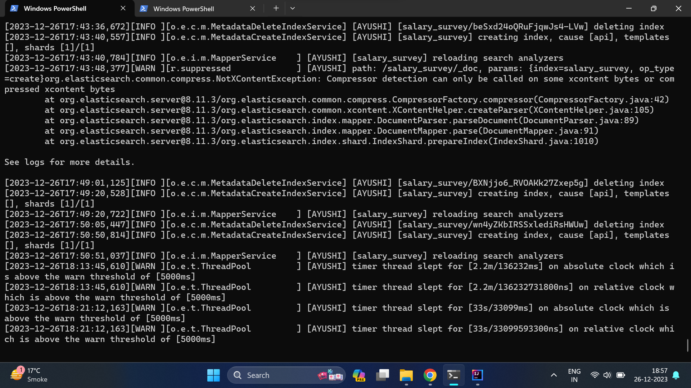
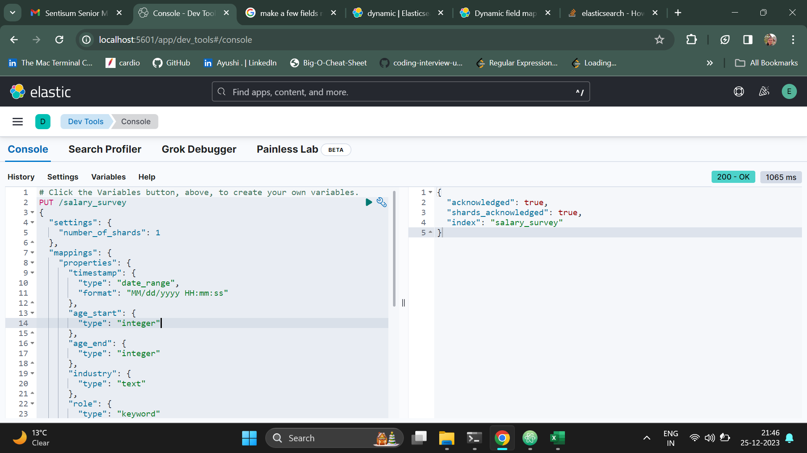
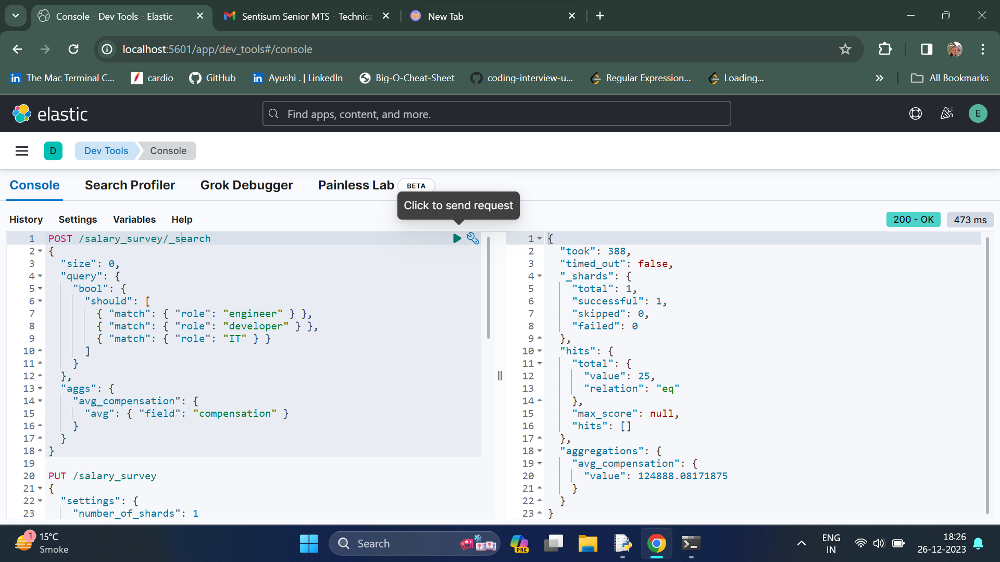
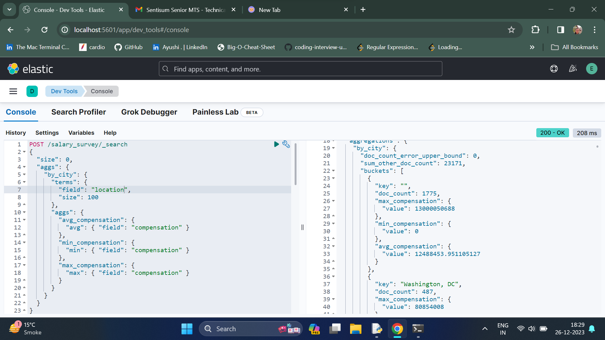
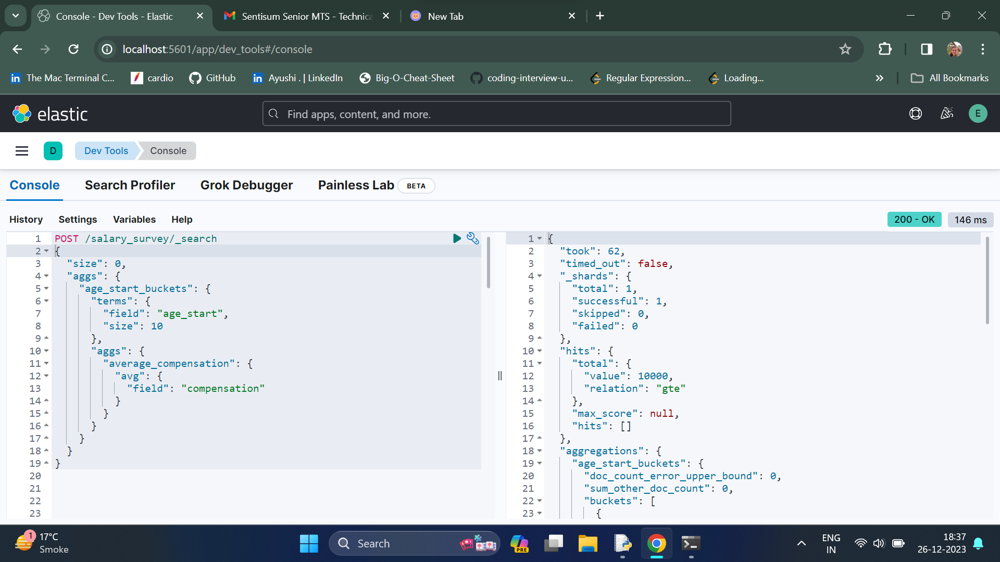

# SalarySurvey

## Exercise A

To begin install ElasticSearch & Kibana from official website.
By default ES is available on localhost port 9200 & Kibana on port 5601

### Some screenshot of Kibana & ES Console running on my Win System.




Points to note:
1) I am trying to combine the necessary fields as per the surveys and the fields which will give the results accurately.
   Hence, I have created a single Index and its mappings. I have explained how I am manipulating the fields to get similar data on similar fields from all three files in the loadcsv.py files for each.

2) I will be loading data from all the three surveys into all these mappings by applying operations wherever required.
   Hence, all the three datasets have been uploaded.


I decided the schema to be set as following.

```aidl
PUT /salary_survey
{
  "settings": {
    "number_of_shards": 1
  },
  "mappings": {
    "properties": {
      "timestamp": {
        "type": "keyword"
      },
      "age_start": {
        "type": "integer"
      },
      "age_end": {
        "type": "integer"
      },
      "industry": {
        "type": "text"
      },
      "role": {
        "type": "keyword"
      },
      "location": {
        "type": "keyword"
      },
      "compensation": {
        "type": "float"
      },
      "experience": {
        "type": "integer"
      },
      "health_insurance": {
        "type": "boolean"
      },
      "employmentType": {
        "type": "keyword"
      }
    }
  }
}

```

I have explained the operations on each of these fields and how I am loading them in the respective files of all these three survey csv.

Let's go file wise:

### For Survey CSV 1
I created a python file to transform the data to json & wrote it as a multiline json file.
The file can be referred [here](ExerciseA/loadSurvey1.py).

After this, I created a separate script to upload the json data to the index.
It can be referred [here](ExerciseA/uploadJSON1.py).

Snapshot of creating Index Mapping



## Exercise Queries

### Query A : Average compensation of roles where the role is some kind of engineer

```aidl
POST /salary_survey/_search
{
  "size": 0,
  "query": {
    "bool": {
      "should": [
        {
          "match": {
            "role": "engineer"
          }
        },
        {
          "match": {
            "role": "developer"
          }
        },
        {
          "match": {
            "role": "IT"
          }
        }
      ]
    }
  },
  "aggs": {
    "avg_compensation": {
      "avg": {
        "field": "compensation"
      }
    }
  }
}
```

### Result
```aidl
{
  "took": 13,
  "timed_out": false,
  "_shards": {
    "total": 1,
    "successful": 1,
    "skipped": 0,
    "failed": 0
  },
  "hits": {
    "total": {
      "value": 25,
      "relation": "eq"
    },
    "max_score": null,
    "hits": []
  },
  "aggregations": {
    "avg_compensation": {
      "value": 124888.08171875
    }
  }
}
```




### Query B : Average, min, and max compensation per city (if available in dataset)


```aidl
POST /salary_survey/_search
{
  "size": 0,
  "aggs": {
    "by_city": {
      "terms": {
        "field": "location",
        "size": 100
      },
      "aggs": {
        "avg_compensation": {
          "avg": { "field": "compensation" }
        },
        "min_compensation": {
          "min": { "field": "compensation" }
        },
        "max_compensation": {
          "max": { "field": "compensation" }
        }
      }
    }
  }
}
```

###Result

```aidl
{
  "took": 25,
  "timed_out": false,
  "_shards": {
    "total": 1,
    "successful": 1,
    "skipped": 0,
    "failed": 0
  },
  "hits": {
    "total": {
      "value": 10000,
      "relation": "gte"
    },
    "max_score": null,
    "hits": []
  },
  "aggregations": {
    "by_city": {
      "doc_count_error_upper_bound": 0,
      "sum_other_doc_count": 23171,
      "buckets": [
        {
          "key": "",
          "doc_count": 1775,
          "max_compensation": {
            "value": 13000050688
          },
          "min_compensation": {
            "value": 0
          },
          "avg_compensation": {
            "value": 12488453.951105127
          }
        },
        {
          "key": "Washington, DC",
          "doc_count": 487,
          "max_compensation": {
            "value": 80854008
          },
          "min_compensation": {
            "value": 81
          },
          "avg_compensation": {
            "value": 269269.47433264885
          }
        },
        {
          "key": "New York, NY",
          "doc_count": 440,
          "max_compensation": {
            "value": 175000125440
          },
          "min_compensation": {
            "value": 15
          },
          "avg_compensation": {
            "value": 397916833.91818184
          }
        },
        {
          "key": "Boston, MA",
          "doc_count": 282,
          "max_compensation": {
            "value": 850001068032
          },
          "min_compensation": {
            "value": 22
          },
          "avg_compensation": {
            "value": 3722838102.039007
          }
        },
        {
          "key": "Chicago, IL",
          "doc_count": 257,
          "max_compensation": {
            "value": 125000253440
          },
          "min_compensation": {
            "value": 60
          },
          "avg_compensation": {
            "value": 518744320.53696495
          }
        },
        {
          "key": "New York, NY, USA",
          "doc_count": 254,
          "max_compensation": {
            "value": 7850058
          },
          "min_compensation": {
            "value": 28
          },
          "avg_compensation": {
            "value": 145287.1692913386
          }
        },
        {
          "key": "Boston, MA, USA",
          "doc_count": 208,
          "max_compensation": {
            "value": 38000112
          },
          "min_compensation": {
            "value": 42
          },
          "avg_compensation": {
            "value": 272922.98557692306
          }
        },
        {
          "key": "Washington DC",
          "doc_count": 200,
          "max_compensation": {
            "value": 28000079872
          },
          "min_compensation": {
            "value": 38
          },
          "avg_compensation": {
            "value": 140103380.235
          }
        },
        {
          "key": "New York City",
          "doc_count": 179,
          "max_compensation": {
            "value": 17200015360
          },
          "min_compensation": {
            "value": 12
          },
          "avg_compensation": {
            "value": 158058418.67597765
          }
        },
        {
          "key": "San Francisco, CA",
          "doc_count": 177,
          "max_compensation": {
            "value": 720008
          },
          "min_compensation": {
            "value": 0
          },
          "avg_compensation": {
            "value": 141527.09604519774
          }
        },
        {
          "key": "New York",
          "doc_count": 176,
          "max_compensation": {
            "value": 250000752640
          },
          "min_compensation": {
            "value": 45
          },
          "avg_compensation": {
            "value": 1446165481.528409
          }
        },
        {
          "key": "Chicago, IL, USA",
          "doc_count": 174,
          "max_compensation": {
            "value": 980005093376
          },
          "min_compensation": {
            "value": 25
          },
          "avg_compensation": {
            "value": 5632421284.172414
          }
        },
        {
          "key": "Los Angeles, CA",
          "doc_count": 163,
          "max_compensation": {
            "value": 3500055040
          },
          "min_compensation": {
            "value": 45
          },
          "avg_compensation": {
            "value": 43061073.220858894
          }
        },
        {
          "key": "Seattle, WA",
          "doc_count": 159,
          "max_compensation": {
            "value": 14000079872
          },
          "min_compensation": {
            "value": 5
          },
          "avg_compensation": {
            "value": 88154885.28930818
          }
        },
        {
          "key": "London",
          "doc_count": 154,
          "max_compensation": {
            "value": 3183089186068496400
          },
          "min_compensation": {
            "value": 48.9702262878418
          },
          "avg_compensation": {
            "value": 20669410299232850
          }
        },
        {
          "key": "Chicago",
          "doc_count": 152,
          "max_compensation": {
            "value": 918001024
          },
          "min_compensation": {
            "value": 8500
          },
          "avg_compensation": {
            "value": 6159364.078947368
          }
        },
        {
          "key": "NYC",
          "doc_count": 148,
          "max_compensation": {
            "value": 350000
          },
          "min_compensation": {
            "value": 18
          },
          "avg_compensation": {
            "value": 103579.20945945945
          }
        },
        {
          "key": "Seattle, WA, USA",
          "doc_count": 147,
          "max_compensation": {
            "value": 600000
          },
          "min_compensation": {
            "value": 95
          },
          "avg_compensation": {
            "value": 108037.68707482993
          }
        },
        {
          "key": "Los Angeles, CA, USA",
          "doc_count": 145,
          "max_compensation": {
            "value": 75000127488
          },
          "min_compensation": {
            "value": 30000
          },
          "avg_compensation": {
            "value": 517358336.4758621
          }
        },
        {
          "key": "San Francisco, CA, USA",
          "doc_count": 143,
          "max_compensation": {
            "value": 13000049664
          },
          "min_compensation": {
            "value": 100
          },
          "avg_compensation": {
            "value": 91043285.16783217
          }
        },
        {
          "key": "Canada",
          "doc_count": 128,
          "max_compensation": {
            "value": 235037.953125
          },
          "min_compensation": {
            "value": 36.15968704223633
          },
          "avg_compensation": {
            "value": 59012.41403058171
          }
        },
        {
          "key": "London, UK",
          "doc_count": 125,
          "max_compensation": {
            "value": 14691129
          },
          "min_compensation": {
            "value": 41.624691009521484
          },
          "avg_compensation": {
            "value": 179983.89331002807
          }
        },
        {
          "key": "Philadelphia, PA",
          "doc_count": 123,
          "max_compensation": {
            "value": 12500025
          },
          "min_compensation": {
            "value": 175
          },
          "avg_compensation": {
            "value": 188693.1219512195
          }
        },
        {
          "key": "Denver, CO",
          "doc_count": 118,
          "max_compensation": {
            "value": 15000020
          },
          "min_compensation": {
            "value": 62
          },
          "avg_compensation": {
            "value": 286399.0847457627
          }
        },
        {
          "key": "San Francisco",
          "doc_count": 118,
          "max_compensation": {
            "value": 500000
          },
          "min_compensation": {
            "value": 66
          },
          "avg_compensation": {
            "value": 152954.5
          }
        },
        {
          "key": "Atlanta, GA",
          "doc_count": 117,
          "max_compensation": {
            "value": 8400016896
          },
          "min_compensation": {
            "value": 62
          },
          "avg_compensation": {
            "value": 71986905.00854701
          }
        },
        {
          "key": "Washington, DC, USA",
          "doc_count": 114,
          "max_compensation": {
            "value": 205000
          },
          "min_compensation": {
            "value": 31200
          },
          "avg_compensation": {
            "value": 91240.33333333333
          }
        },
        {
          "key": "Portland, OR",
          "doc_count": 111,
          "max_compensation": {
            "value": 7200095
          },
          "min_compensation": {
            "value": 6800
          },
          "avg_compensation": {
            "value": 149959.36036036036
          }
        },
        {
          "key": "Boston/MA/USA",
          "doc_count": 105,
          "max_compensation": {
            "value": 550000
          },
          "min_compensation": {
            "value": 33280
          },
          "avg_compensation": {
            "value": 120927.11428571428
          }
        },
        {
          "key": "Philadelphia, PA, USA",
          "doc_count": 104,
          "max_compensation": {
            "value": 500000
          },
          "min_compensation": {
            "value": 22000
          },
          "avg_compensation": {
            "value": 85092.45192307692
          }
        },
        {
          "key": "Texas",
          "doc_count": 104,
          "max_compensation": {
            "value": 5500021248
          },
          "min_compensation": {
            "value": 35
          },
          "avg_compensation": {
            "value": 52999238.692307696
          }
        },
        {
          "key": "New York/NY/USA",
          "doc_count": 103,
          "max_compensation": {
            "value": 1002040
          },
          "min_compensation": {
            "value": 30000
          },
          "avg_compensation": {
            "value": 131590.79611650485
          }
        },
        {
          "key": "Toronto",
          "doc_count": 96,
          "max_compensation": {
            "value": 400000
          },
          "min_compensation": {
            "value": 57.85549545288086
          },
          "avg_compensation": {
            "value": 67711.92646594842
          }
        },
        {
          "key": "Minneapolis, MN",
          "doc_count": 95,
          "max_compensation": {
            "value": 25350000
          },
          "min_compensation": {
            "value": 31000
          },
          "avg_compensation": {
            "value": 351909.27368421055
          }
        },
        {
          "key": "California",
          "doc_count": 94,
          "max_compensation": {
            "value": 350000
          },
          "min_compensation": {
            "value": 220
          },
          "avg_compensation": {
            "value": 98372.3085106383
          }
        },
        {
          "key": "New York, NY USA",
          "doc_count": 88,
          "max_compensation": {
            "value": 515000
          },
          "min_compensation": {
            "value": 22
          },
          "avg_compensation": {
            "value": 126309.55681818182
          }
        },
        {
          "key": "Seattle/WA/USA",
          "doc_count": 87,
          "max_compensation": {
            "value": 650000
          },
          "min_compensation": {
            "value": 75
          },
          "avg_compensation": {
            "value": 122913.0459770115
          }
        },
        {
          "key": "Minneapolis, MN, USA",
          "doc_count": 86,
          "max_compensation": {
            "value": 310000
          },
          "min_compensation": {
            "value": 17800
          },
          "avg_compensation": {
            "value": 86722.52325581395
          }
        },
        {
          "key": "Toronto, Ontario, Canada",
          "doc_count": 86,
          "max_compensation": {
            "value": 723225536
          },
          "min_compensation": {
            "value": 11571.099609375
          },
          "avg_compensation": {
            "value": 8465914.80350654
          }
        },
        {
          "key": "Atlanta, GA, USA",
          "doc_count": 85,
          "max_compensation": {
            "value": 430000
          },
          "min_compensation": {
            "value": 50
          },
          "avg_compensation": {
            "value": 100717.58823529411
          }
        },
        {
          "key": "Austin, TX",
          "doc_count": 85,
          "max_compensation": {
            "value": 240000
          },
          "min_compensation": {
            "value": 23030
          },
          "avg_compensation": {
            "value": 94439.24705882353
          }
        },
        {
          "key": "Chicago/IL/USA",
          "doc_count": 84,
          "max_compensation": {
            "value": 82000000
          },
          "min_compensation": {
            "value": 115
          },
          "avg_compensation": {
            "value": 1071908.1785714286
          }
        },
        {
          "key": "Los Angeles",
          "doc_count": 83,
          "max_compensation": {
            "value": 275000096
          },
          "min_compensation": {
            "value": 115
          },
          "avg_compensation": {
            "value": 3454941.1445783135
          }
        },
        {
          "key": "UK",
          "doc_count": 83,
          "max_compensation": {
            "value": 204864
          },
          "min_compensation": {
            "value": 22.036602020263672
          },
          "avg_compensation": {
            "value": 44914.15134930898
          }
        },
        {
          "key": "United States",
          "doc_count": 82,
          "max_compensation": {
            "value": 4636670
          },
          "min_compensation": {
            "value": 125
          },
          "avg_compensation": {
            "value": 168083.4024390244
          }
        },
        {
          "key": "Boston",
          "doc_count": 81,
          "max_compensation": {
            "value": 7000065
          },
          "min_compensation": {
            "value": 22000
          },
          "avg_compensation": {
            "value": 198468.6913580247
          }
        },
        {
          "key": "Portland, OR, USA",
          "doc_count": 73,
          "max_compensation": {
            "value": 210000
          },
          "min_compensation": {
            "value": 0
          },
          "avg_compensation": {
            "value": 77716.24657534246
          }
        },
        {
          "key": "Chicago, IL USA",
          "doc_count": 71,
          "max_compensation": {
            "value": 5800010
          },
          "min_compensation": {
            "value": 35
          },
          "avg_compensation": {
            "value": 176795.45070422534
          }
        },
        {
          "key": "Ohio",
          "doc_count": 69,
          "max_compensation": {
            "value": 14500020
          },
          "min_compensation": {
            "value": 60
          },
          "avg_compensation": {
            "value": 300942.9130434783
          }
        },
        {
          "key": "USA",
          "doc_count": 68,
          "max_compensation": {
            "value": 300325
          },
          "min_compensation": {
            "value": 0
          },
          "avg_compensation": {
            "value": 95369.73064108456
          }
        },
        {
          "key": "Australia",
          "doc_count": 66,
          "max_compensation": {
            "value": 416130
          },
          "min_compensation": {
            "value": 125.90599822998047
          },
          "avg_compensation": {
            "value": 116311.09949990475
          }
        },
        {
          "key": "Dallas, TX",
          "doc_count": 66,
          "max_compensation": {
            "value": 350000
          },
          "min_compensation": {
            "value": 32000
          },
          "avg_compensation": {
            "value": 106632.33333333333
          }
        },
        {
          "key": "Michigan",
          "doc_count": 66,
          "max_compensation": {
            "value": 380000
          },
          "min_compensation": {
            "value": 45
          },
          "avg_compensation": {
            "value": 81600.22727272728
          }
        },
        {
          "key": "Houston, TX",
          "doc_count": 65,
          "max_compensation": {
            "value": 11500011520
          },
          "min_compensation": {
            "value": 56
          },
          "avg_compensation": {
            "value": 184942649.84615386
          }
        },
        {
          "key": "Florida",
          "doc_count": 64,
          "max_compensation": {
            "value": 112000808
          },
          "min_compensation": {
            "value": 87
          },
          "avg_compensation": {
            "value": 1845357.453125
          }
        },
        {
          "key": "Boston, MA USA",
          "doc_count": 62,
          "max_compensation": {
            "value": 400000
          },
          "min_compensation": {
            "value": 36000
          },
          "avg_compensation": {
            "value": 117875.53225806452
          }
        },
        {
          "key": "Vancouver, BC, Canada",
          "doc_count": 61,
          "max_compensation": {
            "value": 2820489216
          },
          "min_compensation": {
            "value": 112.09502410888672
          },
          "avg_compensation": {
            "value": 46300166.91056136
          }
        },
        {
          "key": "Atlanta/GA/USA",
          "doc_count": 60,
          "max_compensation": {
            "value": 15700075
          },
          "min_compensation": {
            "value": 33000
          },
          "avg_compensation": {
            "value": 373865.93333333335
          }
        },
        {
          "key": "Pittsburgh, PA",
          "doc_count": 60,
          "max_compensation": {
            "value": 500000
          },
          "min_compensation": {
            "value": 16
          },
          "avg_compensation": {
            "value": 83687.1
          }
        },
        {
          "key": "Seattle",
          "doc_count": 60,
          "max_compensation": {
            "value": 3334000
          },
          "min_compensation": {
            "value": 47
          },
          "avg_compensation": {
            "value": 197100.7
          }
        },
        {
          "key": "United Kingdom",
          "doc_count": 60,
          "max_compensation": {
            "value": 158541.109375
          },
          "min_compensation": {
            "value": 10406.1728515625
          },
          "avg_compensation": {
            "value": 49100.50753580729
          }
        },
        {
          "key": "Colorado",
          "doc_count": 59,
          "max_compensation": {
            "value": 375000
          },
          "min_compensation": {
            "value": 9000
          },
          "avg_compensation": {
            "value": 80416.91525423729
          }
        },
        {
          "key": "Denver, CO, USA",
          "doc_count": 59,
          "max_compensation": {
            "value": 320000
          },
          "min_compensation": {
            "value": 31000
          },
          "avg_compensation": {
            "value": 92316
          }
        },
        {
          "key": "Massachusetts",
          "doc_count": 55,
          "max_compensation": {
            "value": 190000
          },
          "min_compensation": {
            "value": 18000
          },
          "avg_compensation": {
            "value": 80058.81818181818
          }
        },
        {
          "key": "San Francisco/CA/USA",
          "doc_count": 54,
          "max_compensation": {
            "value": 525000
          },
          "min_compensation": {
            "value": 34000
          },
          "avg_compensation": {
            "value": 141447.25925925927
          }
        },
        {
          "key": "Germany",
          "doc_count": 53,
          "max_compensation": {
            "value": 176055
          },
          "min_compensation": {
            "value": 48.01499938964844
          },
          "avg_compensation": {
            "value": 66921.42394652456
          }
        },
        {
          "key": "Los Angeles/CA/USA",
          "doc_count": 53,
          "max_compensation": {
            "value": 602000
          },
          "min_compensation": {
            "value": 30000
          },
          "avg_compensation": {
            "value": 128355.58490566038
          }
        },
        {
          "key": "Nashville, TN",
          "doc_count": 53,
          "max_compensation": {
            "value": 400000
          },
          "min_compensation": {
            "value": 35000
          },
          "avg_compensation": {
            "value": 89634.15094339622
          }
        },
        {
          "key": "New Jersey",
          "doc_count": 53,
          "max_compensation": {
            "value": 425000
          },
          "min_compensation": {
            "value": 210
          },
          "avg_compensation": {
            "value": 108697.84905660378
          }
        },
        {
          "key": "Phoenix, AZ",
          "doc_count": 53,
          "max_compensation": {
            "value": 295000
          },
          "min_compensation": {
            "value": 22880
          },
          "avg_compensation": {
            "value": 87353.96226415095
          }
        },
        {
          "key": "Seattle, WA USA",
          "doc_count": 51,
          "max_compensation": {
            "value": 250000
          },
          "min_compensation": {
            "value": 34000
          },
          "avg_compensation": {
            "value": 99167.33333333333
          }
        },
        {
          "key": "San Diego, CA",
          "doc_count": 50,
          "max_compensation": {
            "value": 19500020
          },
          "min_compensation": {
            "value": 180
          },
          "avg_compensation": {
            "value": 475154.4
          }
        },
        {
          "key": "Washington/DC/USA",
          "doc_count": 50,
          "max_compensation": {
            "value": 400000
          },
          "min_compensation": {
            "value": 60
          },
          "avg_compensation": {
            "value": 107784.7
          }
        },
        {
          "key": "Baltimore, MD",
          "doc_count": 49,
          "max_compensation": {
            "value": 180000
          },
          "min_compensation": {
            "value": 36000
          },
          "avg_compensation": {
            "value": 78517.36734693877
          }
        },
        {
          "key": "Dallas, TX, USA",
          "doc_count": 49,
          "max_compensation": {
            "value": 1115000
          },
          "min_compensation": {
            "value": 32000
          },
          "avg_compensation": {
            "value": 133615.7142857143
          }
        },
        {
          "key": "Austin, TX, USA",
          "doc_count": 48,
          "max_compensation": {
            "value": 255000
          },
          "min_compensation": {
            "value": 52
          },
          "avg_compensation": {
            "value": 92724.9375
          }
        },
        {
          "key": "San Diego, CA, USA",
          "doc_count": 48,
          "max_compensation": {
            "value": 265000
          },
          "min_compensation": {
            "value": 20000
          },
          "avg_compensation": {
            "value": 85700.52083333333
          }
        },
        {
          "key": "Toronto/Ontario/Canada",
          "doc_count": 48,
          "max_compensation": {
            "value": 133790.84375
          },
          "min_compensation": {
            "value": 13.017486572265625
          },
          "avg_compensation": {
            "value": 53988.3988831838
          }
        },
        {
          "key": "Maryland",
          "doc_count": 47,
          "max_compensation": {
            "value": 250000
          },
          "min_compensation": {
            "value": 11600
          },
          "avg_compensation": {
            "value": 97286.14893617021
          }
        },
        {
          "key": "New York City, NY, USA",
          "doc_count": 47,
          "max_compensation": {
            "value": 400000
          },
          "min_compensation": {
            "value": 43000
          },
          "avg_compensation": {
            "value": 123996.70212765958
          }
        },
        {
          "key": "Philadelphia/PA/USA",
          "doc_count": 46,
          "max_compensation": {
            "value": 320000
          },
          "min_compensation": {
            "value": 31000
          },
          "avg_compensation": {
            "value": 110714.43478260869
          }
        },
        {
          "key": "Indiana",
          "doc_count": 45,
          "max_compensation": {
            "value": 6000017920
          },
          "min_compensation": {
            "value": 127
          },
          "avg_compensation": {
            "value": 133463996.82222222
          }
        },
        {
          "key": "New York ",
          "doc_count": 45,
          "max_compensation": {
            "value": 200000143360
          },
          "min_compensation": {
            "value": 24000
          },
          "avg_compensation": {
            "value": 4444599490.422222
          }
        },
        {
          "key": "Washington, D.C.",
          "doc_count": 45,
          "max_compensation": {
            "value": 340000145408
          },
          "min_compensation": {
            "value": 109
          },
          "avg_compensation": {
            "value": 7555639923.955556
          }
        },
        {
          "key": "New York, New York, USA",
          "doc_count": 44,
          "max_compensation": {
            "value": 450000
          },
          "min_compensation": {
            "value": 195
          },
          "avg_compensation": {
            "value": 107470.29545454546
          }
        },
        {
          "key": "San Francisco ",
          "doc_count": 44,
          "max_compensation": {
            "value": 24000024
          },
          "min_compensation": {
            "value": 15000
          },
          "avg_compensation": {
            "value": 709966.4545454546
          }
        },
        {
          "key": "San Francisco, CA USA",
          "doc_count": 44,
          "max_compensation": {
            "value": 800000
          },
          "min_compensation": {
            "value": 34000
          },
          "avg_compensation": {
            "value": 139092.20454545456
          }
        },
        {
          "key": "Houston, TX, USA",
          "doc_count": 43,
          "max_compensation": {
            "value": 100000512
          },
          "min_compensation": {
            "value": 537
          },
          "avg_compensation": {
            "value": 2531053.906976744
          }
        },
        {
          "key": "Philadelphia",
          "doc_count": 43,
          "max_compensation": {
            "value": 156000
          },
          "min_compensation": {
            "value": 10800
          },
          "avg_compensation": {
            "value": 81525.16279069768
          }
        },
        {
          "key": "Pittsburgh, PA, USA",
          "doc_count": 43,
          "max_compensation": {
            "value": 525004992
          },
          "min_compensation": {
            "value": 68
          },
          "avg_compensation": {
            "value": 12274841.255813954
          }
        },
        {
          "key": "Portland, Oregon, USA",
          "doc_count": 43,
          "max_compensation": {
            "value": 190000
          },
          "min_compensation": {
            "value": 32000
          },
          "avg_compensation": {
            "value": 78497.3953488372
          }
        },
        {
          "key": "Wisconsin",
          "doc_count": 42,
          "max_compensation": {
            "value": 650000
          },
          "min_compensation": {
            "value": 34500
          },
          "avg_compensation": {
            "value": 90593.80952380953
          }
        },
        {
          "key": "Minneapolis/MN/USA",
          "doc_count": 41,
          "max_compensation": {
            "value": 180000
          },
          "min_compensation": {
            "value": 18
          },
          "avg_compensation": {
            "value": 86388.90243902439
          }
        },
        {
          "key": "New York, New York",
          "doc_count": 41,
          "max_compensation": {
            "value": 250000
          },
          "min_compensation": {
            "value": 20
          },
          "avg_compensation": {
            "value": 94190.29268292683
          }
        },
        {
          "key": "Raleigh, NC",
          "doc_count": 41,
          "max_compensation": {
            "value": 13000020
          },
          "min_compensation": {
            "value": 32000
          },
          "avg_compensation": {
            "value": 413711.0487804878
          }
        },
        {
          "key": "Virginia",
          "doc_count": 41,
          "max_compensation": {
            "value": 7200010
          },
          "min_compensation": {
            "value": 120
          },
          "avg_compensation": {
            "value": 271395.85365853657
          }
        },
        {
          "key": "NJ",
          "doc_count": 40,
          "max_compensation": {
            "value": 400000
          },
          "min_compensation": {
            "value": 0
          },
          "avg_compensation": {
            "value": 108727.5
          }
        },
        {
          "key": "DC",
          "doc_count": 39,
          "max_compensation": {
            "value": 305000
          },
          "min_compensation": {
            "value": 39
          },
          "avg_compensation": {
            "value": 100807.61538461539
          }
        },
        {
          "key": "Madison, WI",
          "doc_count": 39,
          "max_compensation": {
            "value": 240000
          },
          "min_compensation": {
            "value": 12000
          },
          "avg_compensation": {
            "value": 86076.76923076923
          }
        },
        {
          "key": "Milwaukee, WI",
          "doc_count": 39,
          "max_compensation": {
            "value": 275000
          },
          "min_compensation": {
            "value": 96
          },
          "avg_compensation": {
            "value": 77789.1282051282
          }
        }
      ]
    }
  }
}
```




### Query 3 : One interesting query of your choice


Getting avg compensation by running Bucket Aggregation on age_start


```aidl
POST /salary_survey/_search
{
  "size": 0,
  "aggs": {
    "age_start_buckets": {
      "terms": {
        "field": "age_start",
        "size": 10
      },
      "aggs": {
        "average_compensation": {
          "avg": {
            "field": "compensation"
          }
        }
      }
    }
  }
}
```

### Result

```
{
  "took": 14,
  "timed_out": false,
  "_shards": {
    "total": 1,
    "successful": 1,
    "skipped": 0,
    "failed": 0
  },
  "hits": {
    "total": {
      "value": 10000,
      "relation": "gte"
    },
    "max_score": null,
    "hits": []
  },
  "aggregations": {
    "age_start_buckets": {
      "doc_count_error_upper_bound": 0,
      "sum_other_doc_count": 0,
      "buckets": [
        {
          "key": 25,
          "doc_count": 15352,
          "average_compensation": {
            "value": 90133178329.01419
          }
        },
        {
          "key": 35,
          "doc_count": 10361,
          "average_compensation": {
            "value": 21496051660879.957
          }
        },
        {
          "key": 45,
          "doc_count": 4564,
          "average_compensation": {
            "value": 580018438913.3253
          }
        },
        {
          "key": 18,
          "doc_count": 1891,
          "average_compensation": {
            "value": 1683353339116570.8
          }
        },
        {
          "key": 55,
          "doc_count": 1852,
          "average_compensation": {
            "value": 190633459.71503878
          }
        },
        {
          "key": 65,
          "doc_count": 302,
          "average_compensation": {
            "value": 433980523.63193494
          }
        }
      ]
    }
  }
}
```




