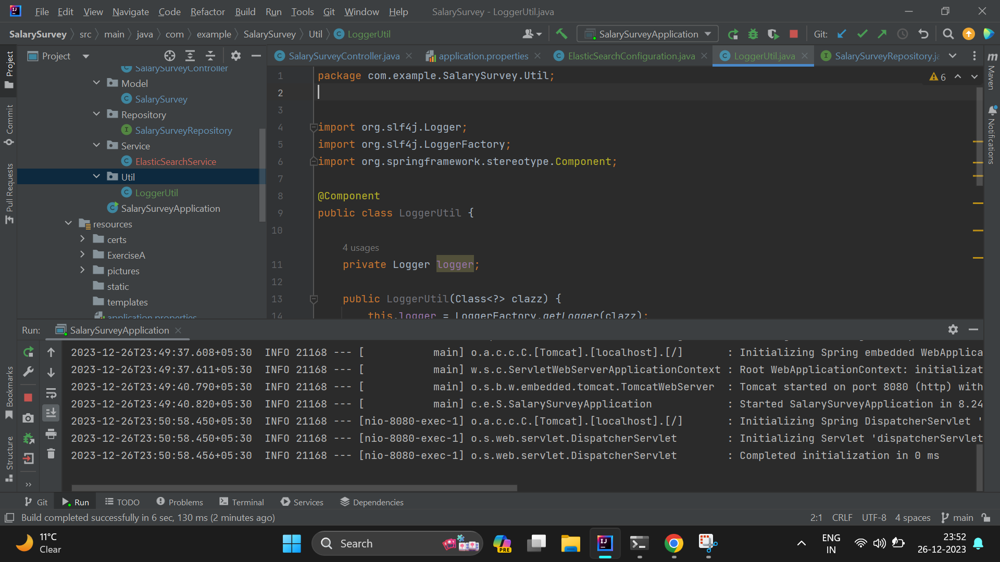
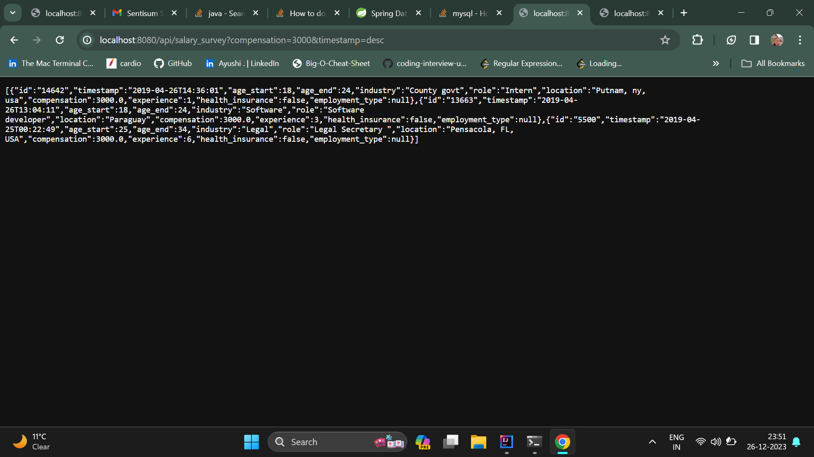
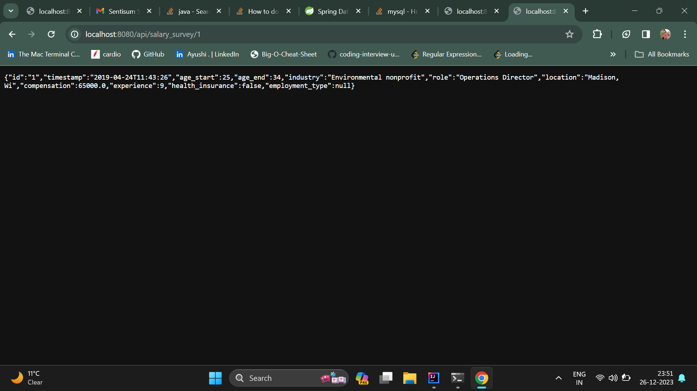

### Salary Survey 

## Exercise B

To Note

1)Set up a springboot project with elasticsearch modules.

2)This is jar packaged project created using maven build

3)The port is live on default (8080)



### GET API For Requirement 1
 
```
http://localhost:8080/api/salary_survey?compensation=3000&timestamp=desc
```


### GET API For Requirement 2

```aidl
http://localhost:8080/api/salary_survey/1
```

